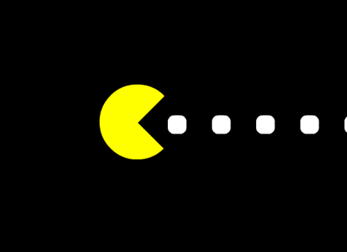

<h1 align="center">Pacman via the Webcam</h1>

  The little PacMan that Waka Waka. Codede by
  <a href="https://github.com/Grinzzly">Grinzzly</a>
  </a>
   
   
  
  &nbsp;
  
   
   
  

## About
This exact branch exist only for git-hub pages deploying purposes. So Waka-Waka out of here :)
