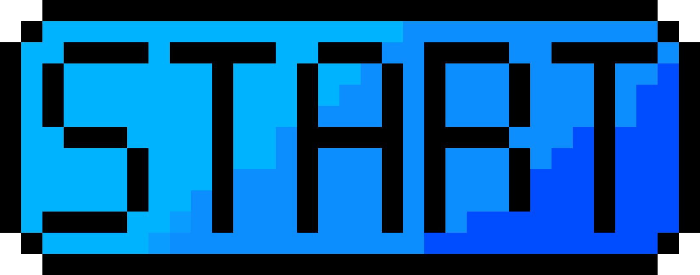

<h1 align="center">Pacman via Webcam</h1>

<div align="center">
  <sub>The little PacMan that Waka Waka. Codede by
  <a href="https://github.com/Grinzzly">Grinzzly</a>
  </a>
  <br>
  <br>
  <a href="https://github.com/airbnb/javascript">
        
  </a>
  &nbsp;
  
  <br>
  <br>
  
  <br>
  <br>
  <div align="center">
    <a href="https://grinzzly.github.io/PacMan-ML/dist/index.html">
      
    </a>
  </div>
</div>

## About
Did you know that the original name for Pac-Man was Puck-Man? You'd think it was because he looks like a hockey puck
but it actually comes from the Japanese phrase 'Paku-Paku,' which means to flap one's mouth open and closed.

## Installation & Usage

From the root of the project directory:
```
yarn install
yarn watch
```
_Use at least 8.9.0 version of Node._
## Technology in use

* __TensorFlow__
* __Vega-Embed__
* __Parcel__
